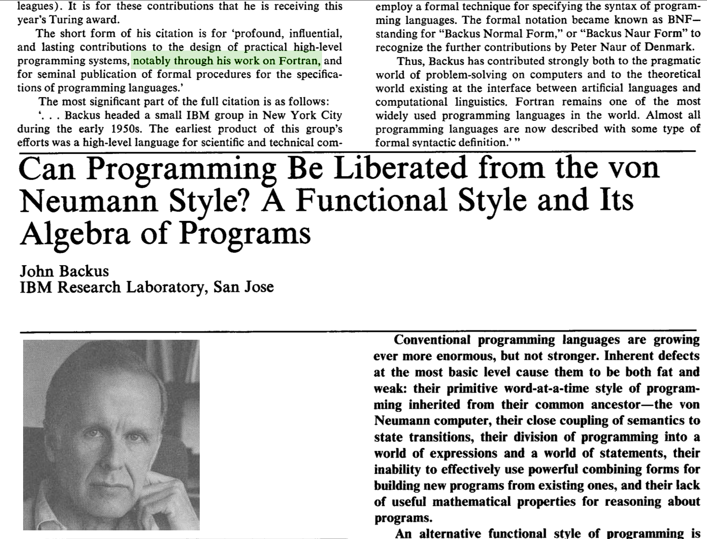

% Functional programming
% Conal Elliott
% July 10, 2012

# Why functional programming?

*   Correctness
    \note{Practical \& precise reasoning.}
*   Productivity
    \note{Captures high-level programming patterns formally for reuse.
    Code is a liability.}
*   \wow{Parallelism}
    \note{Parallel-friendly}

# What is functional programming?

*   Value-oriented
    \note{as opposed to action-oriented}
*   Like arithmetic on big values
    \note{strings, sequences, streams, trees, images, geometry, functions.}

# Finishes a shift that Fortran began

*   Machine/assembly: statements only
    \note{Built up by sequencing.}
    \pause
*   Fortran etc: statements + expressions
    \note{Expressions on RHSs. Nestable!
    Mainstream (imperative) languages are all Fortran variations.}
    \pause
*   Functional: expressions only
    \note{With expressions like these, who needs statements?}

# What makes a language good for parallelism?

...

# What makes a language *bad* for parallelism?

*   Sequential bias
    *   Primitive: assignment (state change)
    *   Composition: *sequential* execution
    *   "Von Neumann" languages (Fortran, C, Java, Python, ...)
*   *Over-linearizes* algorithms.
*   Hard to isolate accidental sequentiality.

# Can we fix sequential languages?

*   Throw in parallel composition
*   Nondeterminism

\ \pause

\ \ \ \ \ 

# Applications perform zillions of simple computations.

*   Compute all at once?
*   Oops -- data dependencies.
*   Minimize dependencies!

# Dependencies

*   Three sources:
    1.   Problem
    2.   Algorithm
    3.   Language
*   Goals: eliminate #3, and reduce #2.

# Dependency in imperative languages

*   Built into sequencing: $A\, ; B$
*   Semantics: $B$ begins where $A$ ends.

# Idea: remove *all* state

*   And, with it,
    *   mutation,
    *   sequencing,
    *   statements.
*   Expression dependencies are specific & explicit.
*   Remainder can be parallel.

\ \pause

*   Contrast: "$A\, ; B$" vs "$A + B$" vs "$(A + B) \times C$".

# Stateless programming

*   Programming is calculation/math:
    *   Precise & tractable reasoning (algebra),
    *   ... including optimization/transformation.
*   No loss of expressiveness!

# Sequential sum

**C:**

~~~{.C}
int sum(int arr[], int n) {
    int acc = 0;
    for (int i=0; i<n; i++)
      acc += arr[i];
    return acc;
}
~~~

\pause

**Haskell:**

> sum = sumAcc 0
>  where
>    sumAcc acc []     = acc
>    sumAcc acc (a:as) = sumAcc (acc + a) as

# Refactoring

> sum = foldl (+) 0

where

> foldl op acc []     = acc
> foldl op acc (a:as) = foldl op (acc `op` a) as

# Parallel sum -- how?

Left-associated sum:

> sum [a,b,...,z] == (...((0 + a) + b) ...) + z

How to parallelize?

Divide and conquer?

# Balanced data

> data Tree a = L a | B (Tree a) (Tree a)

Sequential:

> sum = sumAcc 0
>   where
>    sumAcc acc (L a)   = acc + a
>    sumAcc acc (B s t) = sumAcc (sumAcc acc s) t

Again, `sum = foldl (+) 0`.

\pause

Parallel:

> sum (L a)   = a
> sum (B s t) = sum s + sum t

Equivalent? Why?

# Balance

*   Generalize beyond +,0.
\pause
*   When valid?

# Associative folds

*Monoid*: type with associative operator & identity.

> fold :: Monoid a => [a] -> a

Not just lists:

> fold :: (Foldable f, Monoid a) => f a -> a

Balanced data structures lead to balanced parallelism.

# Two folds

On trees:

> fold :: Monoid a => Tree a -> a
> fold (L a)   = a
> fold (B s t) = fold s `mappend` fold t

\pause

\ 

On lists:

> fold :: Monoid a => [a] -> a
> fold []     = mempty
> fold (a:as) = a `mappend` fold as

\ 

Automatic from types.

# Trickier algorithm: prefix sums

**C:**

~~~{.C}
int prefixSums(int arr[], int n) {
    int sum = 0;
    for (int i=0; i<n; i++) {
        int next = arr[i];
        arr[i] = sum;
        sum += next;
    }
    return sum;
}
~~~

**Haskell:**

> prefixSums = scanl (+) 0

# Prefix sums on trees

> prefixSums = scanl (+) 0
>
> scanl op acc (L a)   = (L acc, acc `op` a)
> scanl op acc (B u v) = (B u' v', uvTot)
>  where
>    (u', uTot) = scanl op acc  u
>    (v',uvTot) = scanl op uTot v

*   Still very sequential.
*   Does associativity help as with `fold`?

# Parallel prefix sums

On trees:

> scan (L a)   = (L mempty, a)
> scan (B u v) = (B u' (adjust <$> v'), adjust vTot)
>  where
>    (u',uTot) = scan u
>    (v',vTot) = scan v
>    adjust = (uTot `mappend`)

*   If balanced, dependency depth $O (\log n)$, work $O (n \log n)$.
*   Can reduce work to $O (n)$.

\pause

*   Generalizes from trees.
*   Automatic from type.

# CUDA parallel prefix sum

    __global__ void scan(float *g_odata, float *g_idata, int n) {
        extern __shared__ float temp[];
        int thid = threadIdx.x;
        int offset = 1;
        temp[2*thid] = g_idata[2*thid];
        temp[2*thid+1] = g_idata[2*thid+1];
        for (int d = n>>1; d > 0; d >>= 1) { 
            __syncthreads();
            if (thid < d) {
                int ai = offset*(2*thid+1)-1;
                int bi = offset*(2*thid+2)-1;
                temp[bi] += temp[ai];
            }
            offset *= 2;
        }
        ...

# CUDA parallel prefix sum (cont)

        if (thid == 0) { temp[n - 1] = 0; }
        for (int d = 1; d < n; d *= 2) {
            offset >>= 1;
            __syncthreads();
            if (thid < d) {
                int ai = offset*(2*thid+1)-1;
                int bi = offset*(2*thid+2)-1;
                float t = temp[ai];
                temp[ai] = temp[bi];
                temp[bi] += t; 
            }
        }
        __syncthreads();
        g_odata[2*thid] = temp[2*thid];
        g_odata[2*thid+1] = temp[2*thid+1];
    }

# 1977 Turing Award -- John Backus

\ \ \ \ \ 
